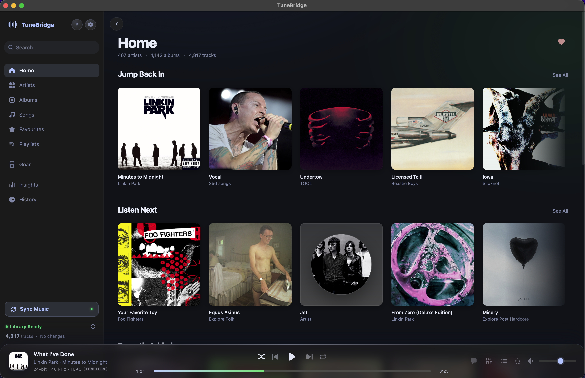
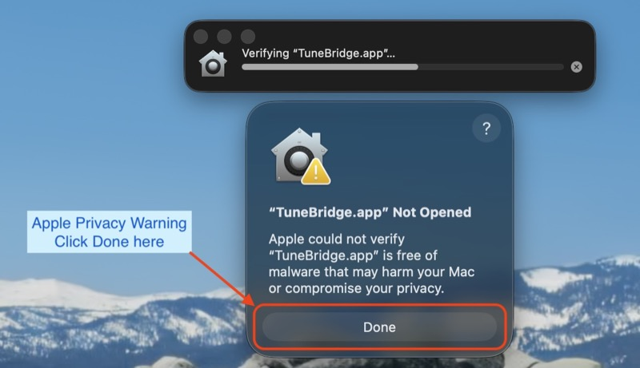
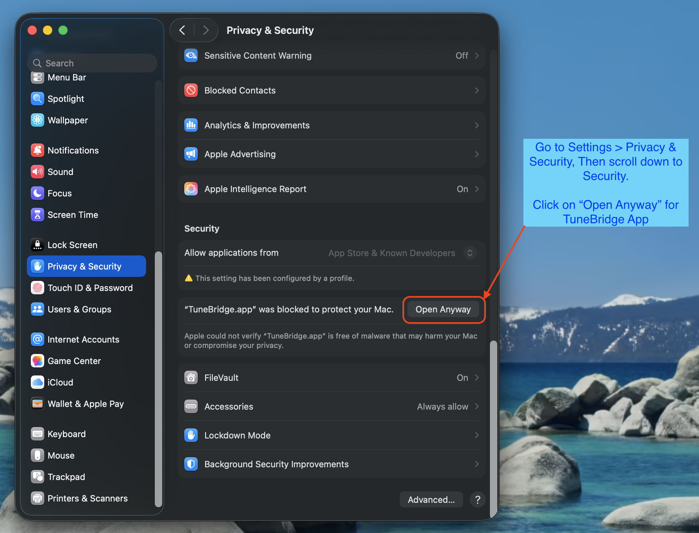

# TuneBridge

**Your personal music library, beautifully managed.**

TuneBridge is a local music manager for macOS built for people who care about their music collection. Browse your FLAC library by artist and album, build and export playlists to portable audio players, and listen in-app with a real-time parametric EQ. Everything runs on your Mac. No accounts, no cloud, no subscriptions.

---

## Download

**[Download TuneBridge v0.322 for macOS →](https://github.com/hashansr/tunebridge-releases/raw/main/TuneBridge-latest.dmg)**

Requires macOS 14 Sonoma or later on an Apple Silicon Mac (M1, M2, M3, or M4). Intel Macs are not supported.

---

## What You Can Do



- **Browse** your music library by artist, album, and track with album art
- **Build playlists** with drag-and-drop track ordering
- **Export playlists** to portable audio players (FiiO, Hiby, AP80, and more)
- **Sync music** bidirectionally between your Mac and a DAP or SD card
- **Play music** in-app with crossfade, shuffle, repeat, and a Web Audio parametric EQ
- **Analyse your library** with Insights: tag health, sonic profiles, and IEM matching
- **Manage headphones**: import frequency response measurements from squig.link and overlay PEQ profiles

---

## Requirements

- macOS 14 Sonoma or later
- Apple Silicon Mac (M1, M2, M3, or M4). Intel Macs are not supported
- A music library organised as `Artist / Album / tracks`
- Supported formats: FLAC, MP3, AAC, M4A, ALAC, OGG, OPUS, WAV, AIFF

---

## Installation

### 1. Download and open the DMG

Download `TuneBridge-latest.dmg` using the link above. Once downloaded, double-click it to mount the disk image.

<!-- SCREENSHOT: DMG window showing TuneBridge.app and the Applications folder shortcut -->

### 2. Drag TuneBridge to Applications

Drag **TuneBridge** into the **Applications** shortcut in the same window. Wait for the copy to finish, then eject the disk image.

### 3. macOS Security Workaround

TuneBridge is distributed outside the Mac App Store and is not notarised by Apple, so macOS will block it the first time you open it. This is expected. Follow either method below.

#### Privacy & Security settings

If you double-clicked TuneBridge and macOS showed a warning, you'll see a dialog like this:



Click **Done** to dismiss it. Then:

1. Open **System Settings** → **Privacy & Security**
2. Scroll down to the **Security** section
3. Find the message **"TuneBridge.app was blocked to protect your Mac"**
4. Click **Open Anyway**



TuneBridge will open after a brief verification. You only need to do this once.

---

## First Launch

On first run, macOS will ask:

> **"TuneBridge would like to access files in your Documents folder."**

Click **Allow**. This permission is required for TuneBridge to read your music library.

<!-- SCREENSHOT: macOS TCC Documents folder access prompt -->

---

## Getting Started

Once TuneBridge is open:

### 1. Set your library path

Click the **Settings** icon in the sidebar → **Library** section → enter the path to your music folder (e.g. `/Volumes/Storage/Music/FLAC`) → click **Save**.

<!-- SCREENSHOT: Settings view with the Library path input field -->

### 2. Scan your library

Click **Rescan Library**. TuneBridge will index all tracks and cache metadata. A progress bar shows the scan status. This takes a minute or two on first run depending on library size.

### 3. Browse and play

Navigate to **Library** in the sidebar to browse by artist and album. Double-click any track to play it in the player bar at the bottom, or click the play button on any album or artist card to queue everything.

<!-- SCREENSHOT: Artist grid view showing album art cards -->

### 4. Build a playlist

Click **+ New Playlist** in the sidebar. Browse to any artist or album and add tracks, whole albums, or an entire artist's catalogue to your playlist. Drag the handles to reorder.

<!-- SCREENSHOT: Playlist view with tracks and drag handles -->

### 5. Export to your DAP

Go to **Gear** → **Digital Audio Players** → add your device with its mount path and model preset. Open any playlist and click the export button for that device.

---

## Music Library Structure

TuneBridge expects your music organised like this:

```
Music/
  Artist Name/
    Album Name/
      01. Track Title.flac
      02. Another Track.flac
  Another Artist/
    ...
```

Files are identified by their embedded tags (not just filenames), so minor naming variations are handled gracefully.

---

## Privacy

TuneBridge runs entirely on your Mac. No usage data, analytics, or personal information is ever collected or transmitted to any service.

Depending on which features you enable, TuneBridge may connect to the following external services to fetch information. All connections are pull-only. Nothing from your library is sent or published.

| Service | Purpose | When it connects |
|---|---|---|
| [lrclib.net](https://lrclib.net) | Lyrics | When you open a track with lyrics enabled |
| [squig.link](https://squig.link) | Headphone frequency response data | When you add an IEM in the Gear section |
| [iTunes Search API](https://developer.apple.com/library/archive/documentation/AudioVideo/Conceptual/iTuneSearchAPI) | Album artwork | When artwork is missing from your library |
| [Last.fm](https://last.fm) | Artist and album artwork | Only if you configure a Last.fm API key in Settings |
| [Fanart.tv](https://fanart.tv) | Artist artwork | When artwork is missing from your library |
| [MusicBrainz](https://musicbrainz.org) | Track metadata | When metadata is missing or incomplete |

Some services (such as Last.fm and Fanart.tv) require you to provide your own API key before TuneBridge will connect to them. None of these connections happen automatically without your configuration.

For full details, see the [Privacy Policy](PRIVACY.md).

---

## Support

TuneBridge is a free, personal project built and maintained in spare time. If it has made your music library a bit more enjoyable, a coffee is always appreciated.

[Buy me a coffee on Ko-fi](https://ko-fi.com/hashan)

No pressure at all. Just happy it's useful.

---

## Licence

Copyright © 2026 Hashan Ranatunga. All Rights Reserved.

This software is provided for personal use only. Redistribution, modification, or commercial use is not permitted without explicit written consent from the author.
